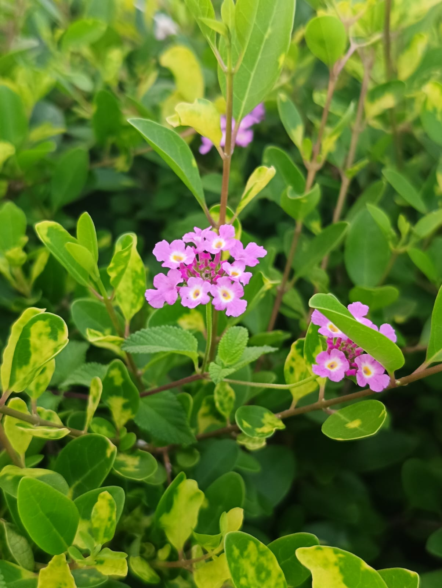
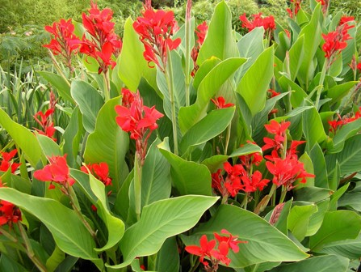

<!--StartFragment-->

On a windy midnight as you walk down the stairway joining the outer ring road to the mess, you can distinctively recognise the subtle, soft fragrance of Cestrum Nocturnum (Night Jasmine). When the wind decides to take a turn, the fragrance pauses a bit. Just a little. And then again, the queen of the night manages to charm you into a calm, solemn mood.

A couple of hours later, when walking back in the scorching heat after a tiring day of classes, the air changes as you approach the dense shade of the Azadirachta Indica (Neem) that sits at the far end of the cricket ground. The bright colours of the bougainvillea that litter every nook and corner do make you pause and appreciate the art that nature brings in its many forms. It is at this moment that you truly appreciate the selfless shade and timeless beauty of the green around you.

IIT Tirupati is blessed with a beautiful campus. Whether it be the unabashed green after the winter rains, the bright flowers in spring or just the smell of earth after a light shower, the green surrounding compliments the modern architecture; you cannot deny it.

So, do we really have a ‘sustainable campus’? The one where you do tech whilst amidst nature? Seems we are already there. It is quite evident in the 15 awards IIT Tirupati has won in the sustainable practices category. Whether it be polished concrete floors, superior finishing techniques in construction, use of natural stones and a multitude of self-sustaining practices, the list is endless.

There are several factors that go behind being sustainable; a major among them is the green around you. But the question remains, what exactly goes on behind maintaining this? Especially during the scorching summers, peek-a-boo monsoons and cyclonic winter rains? The editors at Udaan talked with Mr. Subba Reddy, the horticulture officer at IIT Tirupati to know more about the ground reality. Here’s what we gathered.

For starters, let’s talk a bit about the vegetation. To give some more geographical context, the campus sits beside the Seschachalam and Nallamala forests, a dry deciduous type of vegetation. The plants and trees seen here are not that tall, and they are more shrubs than actual trees. The scorching summers, water scarcity in the Rayalaseema region, and lesser soils are factors that affect vegetation and impose constraints on the efforts of the horticulture team at IIT Tirupati.

Despite the conditions around, the region is home to several unique varieties of flora and fauna that had to make way for the buildings. Reclaiming this lost flora and fauna is one of the main objectives of the sustained efforts to re-green the campus.

One of the distinctive wildlife species found here is the climbing frog and the Chowsingha. Other wildlife species include deer, rabbits, peacocks and a huge variety of butterflies. Interestingly, several medicinal plants call our campus home as well. Among the notable flora species is the Terminalia Chebula (near the Director’s Residence). It is a key component of Triphala Churna, known for its medicinal properties against colds and coughs and is utilised in Kalamkari arts for dye extraction.

Commonly seen on campus are shrubs that are worth mentioning as multi-purpose plants. Many of the shrubs seen here are medicinal in nature and have significant value among locals. They act as a deterrent to weeds, and their vibrant colours play a crucial role in attracting butterflies and adding aesthetic value to the campus. Moreover, shrubs need far less maintenance and function as a food supply for the local fauna.

Wedelia, belonging to the creepers family, have been strategically planted along the slopes next to the Academic Building Complexes to prevent soil erosion. Diverse species such as Fountain Grass, Jamun trees, Mango trees, Bougainvillea, and Wild Dates burlapped on the pond island are just a few instances of the diverse flora our campus currently houses. With 44 species of shrubs and ground covers, 32 species of trees, and numerous flowers and grasses, the campus serves as a thriving habitat for flora and fauna.

An interesting project that is scheduled to come up in the next few years is the establishment of theme-based gardens. In response to the growing popularity of aromatherapy in medicinal applications, plans are in motion to create a garden featuring aromatic flowers, providing visitors with a serene environment to relieve stress through leisurely strolls. A herbal garden with medicinal plants local to Tirupati is also being planned. These gardens are planned on a dedicated land area just next to the lakes. 

Efforts are being made to incorporate sustainability and promote locally available natural resources. Using local stones and completely avoiding inorganic pesticides are some other examples of this. The horticulture department has been repurposing bio-waste into natural fertiliser and employing cut grass as mulch to retain soil, prevent weeds and eventually transform it into valuable manure. Such efforts have found noteworthy appreciation among the local and national community as well. People from IISER Tirupati, National Sanskrit University Tirupati, and other local campuses have come to see the work being done here. It is important to note that during the campus’s dedication to the nation, these sustainable efforts were spotlighted too. 

What goes unnoticed most of the time are the hands and the brains that go behind planning and maintaining vegetation on campus. You must have seen the horticulture staff working throughout the scorching afternoons to bring about a patch of green and colour amidst the grey concrete. The effort involved is praiseworthy. The horticulture department currently consists of 25 individuals who work in various shifts to undertake a multitude of tasks. Common tasks include watering, weeding, pruning, planting saplings etc. The horticulture officer, Mr. Subba Reddy, who provided valuable information for this article, explains the collective effort involved in planning out the green cover on campus. It is surely not as simple as picking out your favourite flower. The geography, water resources, soil type, and surroundings play a pivotal role in deciding which plant and in what form will be selected for plantation. Mr. Subba Reddy has been taking care of all the planning and execution in the Horticulture department. He gives a very simple explanation of ‘why a particular plant is planted somewhere?’.  The logic goes this way: Different coloured flowers, their smells and appearances have a remarkable positive effect on one’s mood, which is why flowers are a natural choice near hostels. Shade-giving trees near roads and parking spaces, bushes and colourful flowers near entrances and roundabout circles are tried-and-tested choices that the department has been implementing. Most of the plant saplings are procured from Kadiyam Nursery, and native plants are from forest department nurseries. He adds that though it will take some time for these saplings to take root and be big enough to give shade,  it will be a pretty and a pretty sustainable campus, nevertheless. 

On the student front, the Horticulture department also plans activities, sometimes in collaboration with the NSS. Currently, we have a vegetable garden in front of the Sahana Hostel in the South Campus. Future activities currently look feasible, but they would require students’ involvement, time, and a wee bit of patience.

Flowers, plants and trees are man’s nearest and closest links with nature. It is certainly reassuring that the Institute has made solid efforts to concretise these bonds.

<!--EndFragment-->